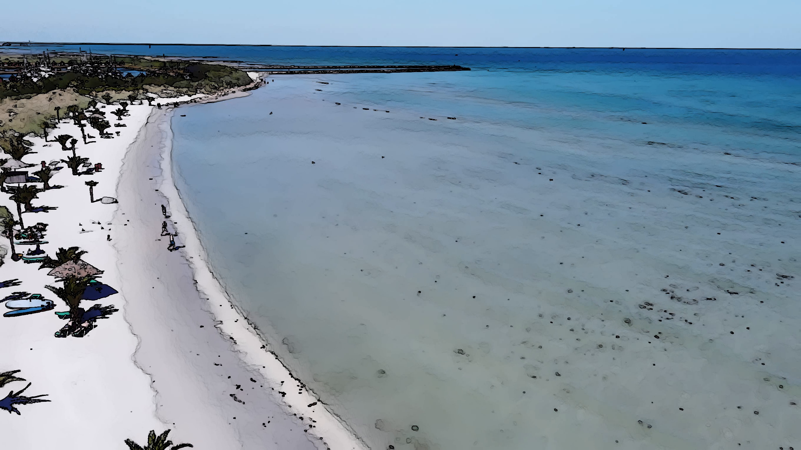

# Introduction
This script provides an API for applying styles (cartoon, watercolor, sketch), or style transfer of any user-chosen image onto a video feed of any common format.

# Examples

Original frame  

Stylized frame (Watercolor)  

